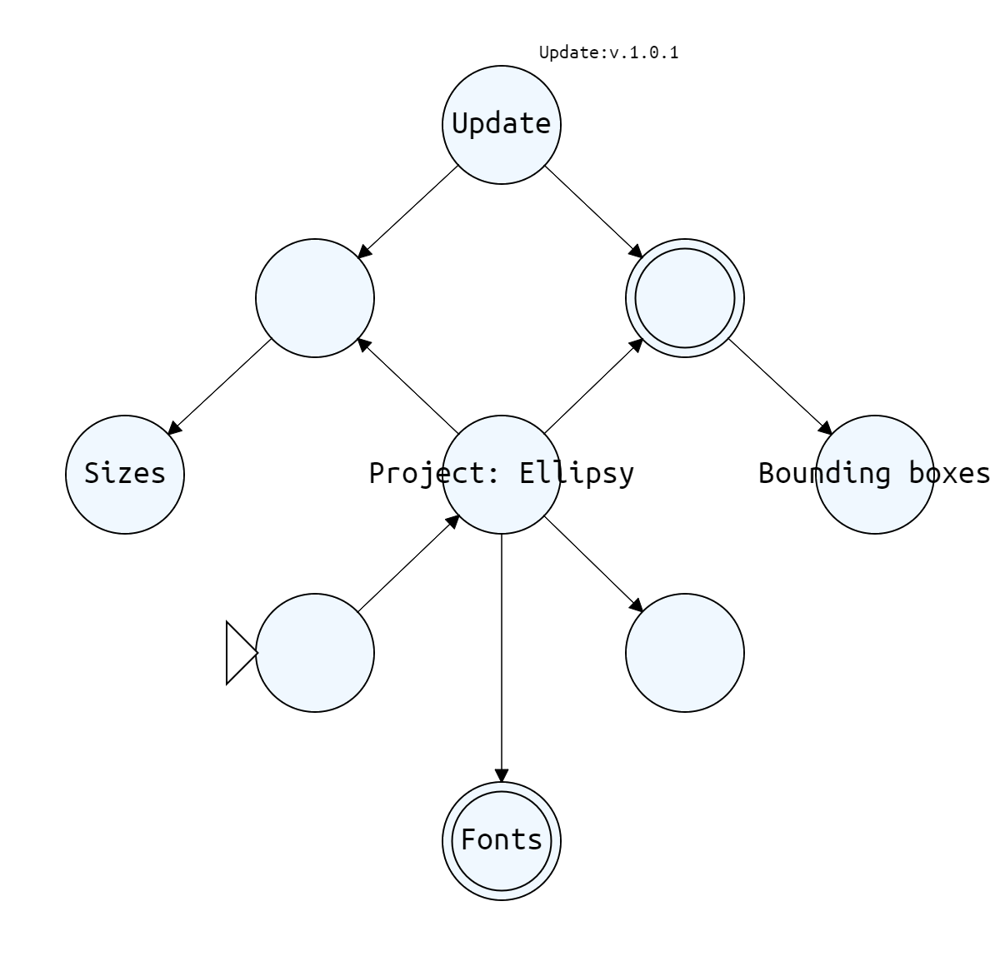

# Project-Elipsi
 Un proyecto creado para mi clase de Teoría de la computación, para se utilizado por futuras generaciones, siendo mejorado, y perfeccionado

 ## Controles

- Doble click: Crear nuevo círculo.
- Doble click sobre círculo: Cambiar su tipo.
- Click normal (sobre un círculo): lo "seleccionas" para escribir.
- Click normal (sobre una flecha): la "seleccionas" para escribir.
- Shit+Click (en un círculo): Arrastras una línea para unir 2 círculos.
- Ctrl+Click (en una flecha): Mueves la flecha arriba o abajo.
- Tecla 'D' (sobre una flecha o círculo): Eliminas un círculo y sus conexiones, o sólo esa flecha específica.

## Update!!

